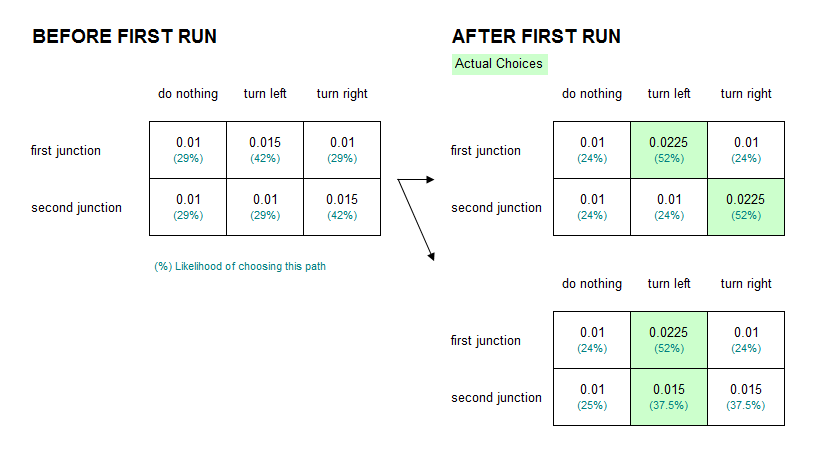

# fusspot

[](https://travis-ci.org/sdesalas/fusspot)

Fusspot is a learning engine I've been meaning to write for 20-odd years. Its only now that it has become relevant as I am building [nodebots](http://nodebots.io/).

Fusspot is non-deterministic, you can train it to be biased towards certain responses with patience, but it will just as likely learn on its own or veer away from what it has learnt (ie, do what it likes rather than what its told). 

At present it uses a simple grid of inputs and outputs, with links between them (think squares in a game of chess) being biased positively and negatively depending on training. Choices are made randomly but biased according to the weight assigned to each square. 

```js
var grid = new fusspot.Grid();
grid.output('red pill');
grid.output('blue pill');
grid.predict('left hand'); // 1/3 each pill, 1/3 nothing - and will remember its choice with until told otherwise.

grid.strengthen('left hand', 'red pill');
grid.strengthen('left hand', 'red pill');
grid.predict('left hand'); // will most likely say 'red pill', but not certainly.

grid.certain('left hand', 'blue pill');
grid.predict('left hand'); // will almost certainly say 'blue pill'.

grid.predict('right hand'); // what?? I never heard of a right hand! -> 1/3 each pill, 1/3 nothing
```

Another example. Note that the result of the last 2 calls will become reinforce with each use.

```js
var grid = new fusspot.Grid({ baseWeight: 0.01, learningRate: 0.5 }); // start at 0.01, 50% weight change when learning
grid.likely('first junction', 'turn left');
grid.likely('second junction', 'turn right');
grid.predict('first junction'); // probably 'turn left'
grid.predict('second junction'); // probably 'turn right'
```



While this is sufficient for very simplistic scenarios, more complex scenarios (think: time-series input from analog sensors) require inputs to be turned into vectors so that the engine is called with the vector signature covering a whole list of similar inputs rather than each individual one, I am currently doing this separately but might incorporate the process into this algorithm if I think it makes sense.
